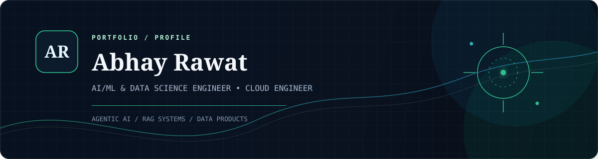

<p align="center">
  
</p>

<p align="center">
  <a href="https://mr-spectr.github.io/my-portfolio/"></a>
  <a href="mailto:workwithabhay3006@gmail.com"></a>
  <a href="https://www.linkedin.com/in/abhay-rawat-790b24288/"></a>
  <a href="https://github.com/Mr-Spectr"></a>
</p>

<p align="center"><strong>AI/ML & Data Science Engineer · Cloud Engineer · Bengaluru, India</strong></p>

## ◈ About

I am an Information Science and Engineering student at Nitte Meenakshi Institute of Technology and a Data Science and Programming scholar at IIT Madras. I build practical AI and software systems with a focus on agentic AI, retrieval-augmented generation (RAG), FastAPI backends, data-driven analytics, and Flutter applications.

> [!TIP]
> I enjoy turning complex technical ideas into useful, well-engineered products - from secure knowledge agents and analytics platforms to polished mobile experiences.

### `// Current focus`

`Agentic AI` `RAG systems` `FastAPI` `Data products` `Flutter` `Cloud-native engineering`

- 🌐 **Portfolio:** [mr-spectr.github.io/my-portfolio](https://mr-spectr.github.io/my-portfolio/)
- 📄 **Resume:** [View PDF](https://mr-spectr.github.io/my-portfolio/abhay-rawat-resume.pdf)
- ✉️ **Email:** [workwithabhay3006@gmail.com](mailto:workwithabhay3006@gmail.com)
- 🔗 **Links:** [LinkedIn](https://www.linkedin.com/in/abhay-rawat-790b24288/) · [GitHub](https://github.com/Mr-Spectr) · [Credly](https://www.credly.com/users/abhay-rawat.d65578c3/badges/credly)

## ◈ Education

| | Programme | Institution | Timeline |
| :-- | :-- | :-- | :-- |
| 🎓 | **B.E. in Information Science and Engineering**<br />CGPA: **8.5 / 10.0** | Nitte Meenakshi Institute of Technology, Bengaluru | Aug 2023 - Jul 2027 |
| 📘 | **B.Sc. in Data Science & Programming** | Indian Institute of Technology Madras | May 2024 - Present |

## ◈ Technical toolkit

| Focus | Tools and strengths |
| :-- | :-- |
| `⌘` Programming | Python, C++, Java, JavaScript, MySQL |
| `⚙` Frameworks | FastAPI, Flutter, Firebase, Docker, Git, GitHub |
| `◫` Foundations | Data Structures & Algorithms, OOP, Operating Systems, Computer Networks, DBMS |
| `✦` AI & data | Pandas, scikit-learn, TensorFlow, PyTorch, NLP, RAG |
| `☁` Cloud | AWS, Google Cloud Platform |

## ◈ Selected work

### 01 / Enterprise Knowledge Agent

`Python` `FastAPI` `MySQL` `RAG` `Groq API` `n8n` `Docker`

An agentic AI platform for secure, context-aware knowledge retrieval across structured and unstructured organisational data.

- Built FastAPI services, retrieval pipelines, role-based access control, workflow automation, and report generation.
- Designed for real-time queries and multi-format exports.

[Explore the repository →](https://github.com/Mr-Spectr/Enterprise-Knowledge-Agent-AgenticAI-)

### 02 / MACRA

`Python` `JavaScript` `scikit-learn` `SQL` `REST APIs`

A financial market analytics and decision-support platform that converts market data into actionable signals.

- Analysed PE ratio, PB ratio, dividend yield, and market capitalisation.
- Developed ingestion workflows, predictive models, and REST APIs for scalable analysis.

[Explore the repository →](https://github.com/Mr-Spectr/MACRA)

### 03 / FlutChat

`Flutter` `Dart` `Firebase Auth` `Firestore`

A real-time chat application built around Firebase Authentication and Firestore synchronisation.

- Applied modular architecture and state management for responsiveness and maintainability.

[Explore the repository →](https://github.com/Mr-Spectr/FlutChat)

### 04 / GameMania

`Flutter` `Dart` `OOP` `UI animation`

A multi-game Flutter platform with interactive mechanics, animated UI components, and a modular object-oriented foundation.

[Explore the repository →](https://github.com/Mr-Spectr/GameMania)

## ◈ Credentials & achievements

| ✦ Credentials | ⌁ Highlights |
| :-- | :-- |
| Google Cloud Engineering & Foundations<br />AWS Cloud Architecture & Foundations<br />Azure AI & DevOps Fundamentals | **Amazon ML Challenge** - top 15% nationally<br />**Code Cadets Hackathon, IISc** - top 5% among 500+ participants<br />**Smart India Hackathon 2025** - institute representative |
| IIT Madras Data Science Foundations<br />Algorithmic Thinking, Rice University<br />Python for Data Science, AI/MLOps, NLP & Deep Learning | [View verified badges on Credly →](https://www.credly.com/users/abhay-rawat.d65578c3/badges/credly) |

---

<details>
<summary><strong>Portfolio development</strong></summary>

The editable React/Vite source lives in [`app/`](app/); the repository root contains the static GitHub Pages bundle.

```powershell
npm install
npm run lint
npm run build
```

</details>

<p align="center"><sub>Designed and built by Abhay Rawat · Always learning, always shipping.</sub></p>
